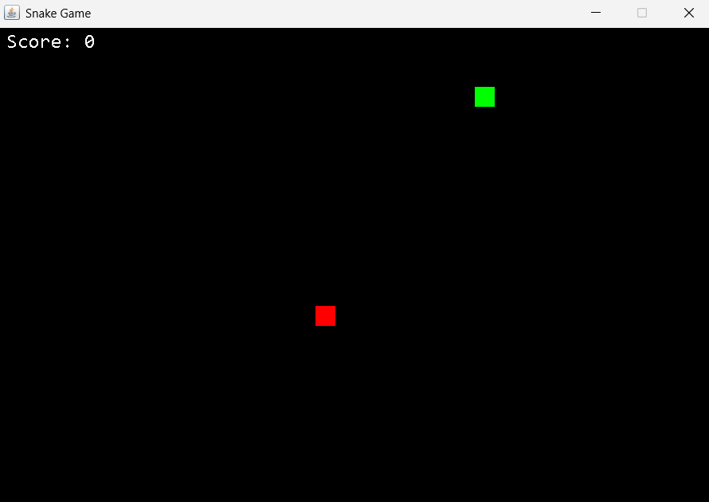

# 🐍 Snake Game

Classic Snake game built with Java Swing

  
*Control the snake to collect food and grow longer*

## ▶ Controls

```
W or ↑    - Move Up
S or ↓    - Move Down
A or ←    - Move Left
D or →    - Move Right
```

## ✨ Features

- **Score system** - Earn points for each food collected
- **Snake growth** - Body extends after eating
- **Wall wrapping** - Teleports to opposite side
- **Collision detection** - Game ends if snake hits itself
- **Random food** - Appears at random positions

## ⚙ Technical Specs

```
Board Size:    720x480 pixels
Unit Size:     20px
Game Speed:    100ms/frame (~10 FPS)
Data Structure: LinkedList for snake body
```

## 📦 Future Updates

- [ ] Main menu screen
- [ ] High score tracking
- [ ] Difficulty levels
- [ ] Sound effects
- [ ] Pause functionality

---

✉ **Author**: [Theo](https://github.com/Theodtell)
